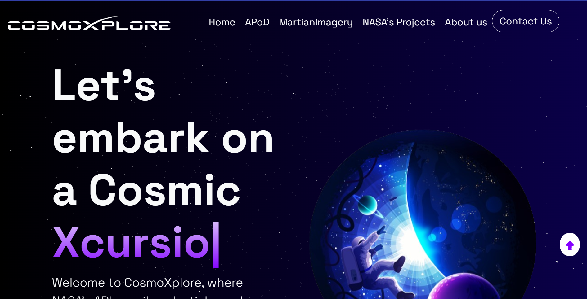
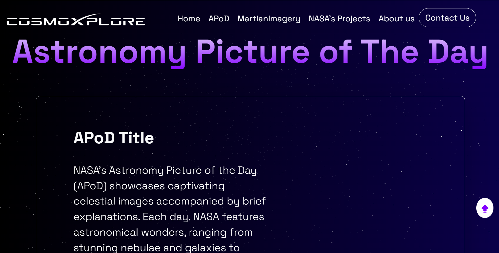
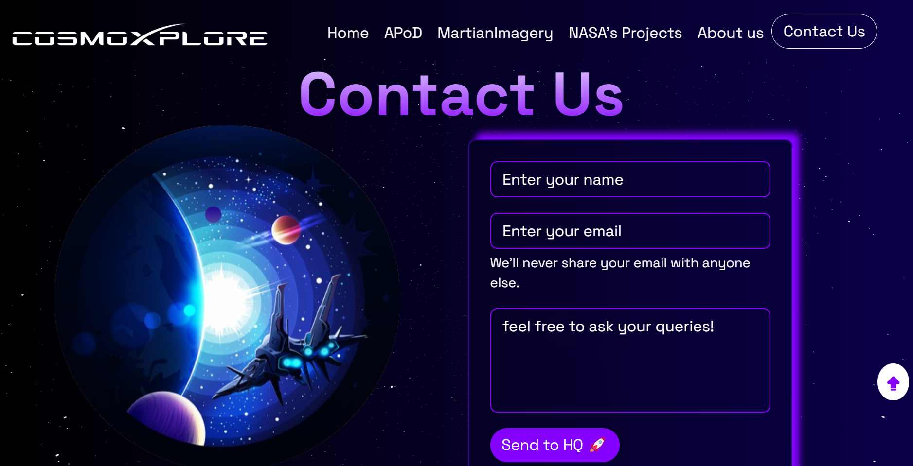

---

# 🌌 CosmoXplore

**Welcome, new contributors to CosmoXplore! We're excited to have you join us as we explore the cosmos.**

 <br>
 <br>
 <br>
 <br>
 <br>
---

# Preview of Website





---

<h2><font size="6">Tech Stack</font></h2>

<a href="https://developer.mozilla.org/en-US/docs/Glossary/HTML5"></a>
<a href="https://developer.mozilla.org/en-US/docs/Web/JavaScript"></a>
<a href="https://developer.mozilla.org/en-US/docs/Web/CSS"></a>
<a href="https://developer.mozilla.org/en-US/docs/Web/React"></a>

---
##  Steps to Run the Project 👨‍💻

1. **Clone the Forked Repository:** Clone the repository to your local development environment by opening the terminal or command prompt and executing the following command:

   ```bash
   git clone https://github.com/<your-github-username>/cosmoXplore.git
   ```

2. **Navigate to Your Repository:** Navigate to your new project directory by using the command:

   ```bash
   cd cosmoXplore
   ```

3. **Install Required Packages:** Install the packages required for the project:

   ```bash
   npm install
   ```

4. **Add Environment Variables:** Create a `.env` file and add Environment Variables as mentioned in `.env.demo` file.


5. **Start the Server:** Start the server:

   ```bash
   npm run dev
   ```

6. **Local Host:** Access the project on your local host at:

   ```bash
   http://localhost:5173/
   ```

---


Feel free to explore and contribute to CosmoXplore! If you have any questions or need assistance, don't hesitate to reach out to us. Happy coding! 🌠

---
<div align="center">
<h2><font size="6"> Contributors </font></h2>
</div>
<br>

- This project thanking all the contributors for having your valuable contribution to our project
- Make sure you show some love by giving ⭐ to our repository

<br>

<center>
<a href="https://github.com/PranavBarthwal/cosmoXplore/graphs/contributors">
  
</a>
</center>
<br>
<p align="right"><a href="#top">Back to top</a></p>
